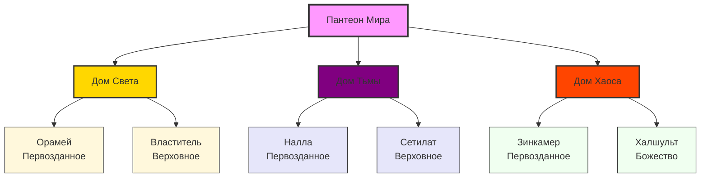

# 🏛️ Пантеон Мира

> [!quote] *"В мире существует четыре основных Дома богов, каждый со своими принципами и последователями..."*

## 📊 Обзор Домов

```dataview
TABLE 
  length(file.inlinks) AS "Количество богов",
  file.link AS "Дом"
FROM #божество
GROUP BY pantheon
SORT pantheon ASC
```

## 👑 Иерархия Богов

### По Рангам

```dataview
TABLE 
  file.link AS "Бог",
  pantheon AS "Дом",
  domain AS "Домены"
FROM #божество
SORT rank ASC, file.name ASC
```

### По Домам

#### 🏮 Дом Света
```dataview
TABLE 
  file.link AS "Бог",
  rank AS "Ранг",
  domain AS "Домены",
  symbol AS "Символ"
FROM #божество
WHERE pantheon = "Дом Света"
SORT rank ASC, file.name ASC
```

#### 🌑 Дом Тьмы
```dataview
TABLE 
  file.link AS "Бог",
  rank AS "Ранг",
  domain AS "Домены",
  symbol AS "Символ"
FROM #божество
WHERE pantheon = "Дом Тьмы"
SORT rank ASC, file.name ASC
```

#### 🌪️ Дом Хаоса
```dataview
TABLE 
  file.link AS "Бог",
  rank AS "Ранг",
  domain AS "Домены",
  symbol AS "Символ"
FROM #божество
WHERE pantheon = "Дом Хаоса"
SORT rank ASC, file.name ASC
```

## 🎯 Статистика

### Распределение по Рангам
```dataviewjs
// Получаем всех богов
const gods = dv.pages('#божество');

// Группируем по рангам
const rankStats = {};
gods.forEach(god => {
    const rank = god.rank || "Неизвестно";
    if (!rankStats[rank]) {
        rankStats[rank] = 0;
    }
    rankStats[rank]++;
});

// Создаем таблицу
const rankOrder = ["Полу-бог", "Низшее божество", "Божество", "Верховное божество", "Первозданное божество"];
const tableData = rankOrder
    .filter(rank => rankStats[rank])
    .map(rank => [rank, rankStats[rank]]);

dv.table(["Ранг", "Количество"], tableData);
```

### Распределение по Домам
```dataviewjs
// Получаем всех богов
const gods = dv.pages('#божество');

// Группируем по пантеонам
const pantheonStats = {};
gods.forEach(god => {
    const pantheon = god.pantheon || "Неизвестно";
    if (!pantheonStats[pantheon]) {
        pantheonStats[pantheon] = 0;
    }
    pantheonStats[pantheon]++;
});

// Создаем таблицу
const pantheonOrder = ["Дом Света", "Дом Тьмы", "Дом Хаоса"];
const tableData = pantheonOrder
    .filter(pantheon => pantheonStats[pantheon])
    .map(pantheon => [pantheon, pantheonStats[pantheon]]);

dv.table(["Дом", "Количество богов"], tableData);
```

## 🗺️ Карта Домов



## 📈 Диаграмма Силы

```dataviewjs
// Получаем всех богов
const gods = dv.pages('#божество');

// Создаем данные для диаграммы
const chartData = gods.map(god => ({
    name: god.file.name,
    rank: god.rank || "Неизвестно",
    pantheon: god.pantheon || "Неизвестно"
}));

// Создаем HTML для диаграммы
const html = `
<div class="pantheon-chart">
    <div class="chart-title">Распределение богов по рангам и домам</div>
    <div class="chart-container">
        ${chartData.map(god => `
            <div class="god-card ${god.pantheon.toLowerCase().replace(/\s+/g, '-')} ${god.rank.toLowerCase().replace(/\s+/g, '-')}">
                <div class="god-name">${god.name}</div>
                <div class="god-rank">${god.rank}</div>
                <div class="god-pantheon">${god.pantheon}</div>
            </div>
        `).join('')}
    </div>
</div>
`;

dv.paragraph(html);
```

## 🔗 Связанные файлы

```dataview
LIST
FROM #божество
SORT file.name ASC
```

## 📝 Заметки

- **Первозданные божества** - самые древние и могущественные боги
- **Верховные божества** - главы своих домов
- **Божества** - обычные боги среднего уровня
- **Низшие божества** - младшие боги
- **Полу-боги** - существа с божественной кровью

> [!tip] Война Богов
> Большинство богов участвовали в великой войне, которая изменила баланс сил в мире. Некоторые были заточены, другие получили новые возможности.
